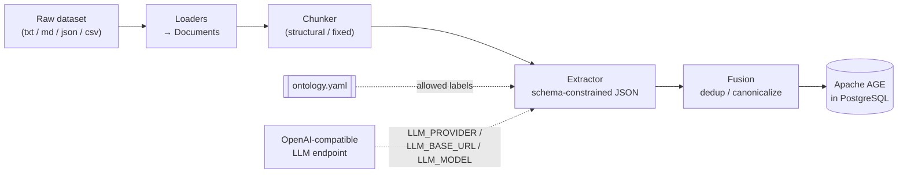

# kg-pipeline

**Turn any text dataset into a queryable knowledge graph using any OpenAI-compatible LLM and PostgreSQL + Apache AGE.**

`kg-pipeline` is a modular, config-driven pipeline: it loads documents, chunks them
along their natural structure, extracts entities and relationships with an LLM
constrained to a declared ontology, fuses duplicate entities into canonical nodes,
and stores the result as a property graph in Apache AGE — which runs openCypher *inside*
PostgreSQL. The ontology is a YAML file, so swapping domains (Constitution → movies →
anything) is an edit to that file, never to Python. And because every provider from
OpenRouter to vLLM to a local Ollama speaks the OpenAI Chat Completions API, the LLM
is a set of `.env` values, not a code path.

---

## Architecture



The five stages map to modules behind interfaces, so each can be swapped independently:

- **Load** (`kg.ingest.loaders`) — `.txt/.md/.json/.csv` → normalized `Document`s.
- **Chunk** (`kg.ingest.chunkers`) — structure-aware (headers/sections) or fixed-size.
- **Extract** (`kg.extract`) — one ontology-constrained LLM call per chunk; off-ontology
  output is dropped and logged.
- **Fuse** (`kg.fusion`) — normalize names, merge duplicates, rewire edges.
- **Store** (`kg.store.age_store`) — idempotent `MERGE` upserts into AGE, with `agtype`
  deserialization on read.

---

## Prerequisites

- **Python 3.11+**
- **Docker** (+ Docker Compose)
- **An LLM endpoint.** Anything that speaks the OpenAI Chat Completions API:

  | Provider | `LLM_PROVIDER` | Endpoint | Notes |
  |---|---|---|---|
  | [OpenRouter](https://openrouter.ai) | `openrouter` | hosted | one key, hundreds of models; see below |
  | [vLLM](https://docs.vllm.ai) | `vllm` | self-hosted | the usual choice for sensitive corpora |
  | OpenAI | `openai` | hosted | |
  | Together / Fireworks | `together` / `fireworks` | hosted | |
  | LiteLLM proxy | `litellm` | self-hosted gateway | |
  | Ollama | `ollama` | local | same client, `http://localhost:11434/v1` |

  The provider name only fills preset defaults; `LLM_BASE_URL` + `LLM_MODEL` +
  `LLM_API_KEY` in `.env` are what actually route the calls.

---

## Setup

```bash
git clone <your-repo-url> kg-pipeline && cd kg-pipeline
cp .env.example .env            # then edit POSTGRES_PASSWORD + LLM_* values

docker compose up -d            # starts PostgreSQL 16 + Apache AGE

python3 -m venv .venv && source .venv/bin/activate
pip install -r requirements.txt
pip install -e .                # installs the `kg` console command
```

Confirm it's alive:
```bash
docker compose ps              # kg-age should be (healthy)
kg info                        # prints effective config + ontology (no DB/LLM needed)
kg info --check-llm            # pings the endpoint: wrong URL/dead key fails in seconds
```

### Using OpenRouter

1. Create a key at `openrouter.ai/keys` and add credit.
2. Set `.env`:
   ```bash
   LLM_PROVIDER=openrouter
   LLM_API_KEY=sk-or-...
   LLM_MODEL=qwen/qwen3-30b-a3b-instruct    # slugs are vendor/model — check the model page
   ```
3. Sanity-check the key and slug before ingesting:
   ```bash
   curl https://openrouter.ai/api/v1/chat/completions \
     -H "Authorization: Bearer $LLM_API_KEY" -H "Content-Type: application/json" \
     -d '{"model":"qwen/qwen3-30b-a3b-instruct","messages":[{"role":"user","content":"say ok"}]}'
   ```

Things worth knowing:

- **Structured-output support is per endpoint, not per model.** The client sets
  `provider.require_parameters = true` whenever a schema is sent, so OpenRouter
  only routes to endpoints that honour `response_format` — without it you can get
  valid JSON that silently ignores your ontology.
- **Rate limits (429s) are normal.** The client retries with backoff; keep
  `LLM_CONCURRENCY` modest (4–8) until you know your account's limits.
- **Prompts transit third-party inference providers.** For sensitive corpora pin
  `LLM_ALLOWED_PROVIDERS` to vendors your legal team approved — or use vLLM.
- Model slugs can be re-pointed upstream; pin dated slugs where offered to keep
  extraction output stable.

### Using vLLM

```bash
pip install vllm
vllm serve Qwen/Qwen3-30B-A3B-Instruct \
  --served-model-name kg-extractor \
  --api-key "$VLLM_API_KEY" \
  --host 0.0.0.0 --port 8000 \
  --max-model-len 8192 \
  --gpu-memory-utilization 0.90 \
  --tensor-parallel-size 2          # = number of GPUs
```

```bash
# .env
LLM_PROVIDER=vllm
LLM_BASE_URL=http://localhost:8000/v1     # must end in /v1
LLM_MODEL=kg-extractor                    # = --served-model-name
LLM_API_KEY=$VLLM_API_KEY                 # whatever you passed to --api-key
```

Things worth knowing:

- **`--max-model-len` must exceed prompt + ontology + output.** Truncated
  extractions log a `finish_reason=length` warning — raise `--max-model-len`
  and `LLM_MAX_TOKENS`, or shrink `CHUNK_SIZE`.
- **Constrained decoding is genuinely enforced** here, unlike prompt-only JSON —
  a real accuracy win for ontology-constrained extraction. The structured-output
  parameter names changed across vLLM versions (`guided_json` was removed in
  0.12.0); the client starts with standard `response_format` and falls back
  automatically, so both old and new servers work. Pin `LLM_STRUCTURED_MODE`
  once you know which you're on.
- Concurrency is nearly free under vLLM's continuous batching — raise
  `LLM_CONCURRENCY` (32 is reasonable) rather than adding worker processes.

---

## Usage

```bash
kg init                                   # create the AGE graph (idempotent)
kg ingest data/samples/example.txt        # run the full pipeline
kg query "MATCH (n) RETURN n LIMIT 10"    # run an openCypher query
```

Other commands:
```bash
kg ingest data/samples/ --limit 5         # ingest a directory, first 5 chunks only
kg info                                   # show resolved config + ontology labels
```

Point the CLI at a different config with `--env <file>` (handy for different ontologies /
graphs — see below).

### Example queries

```bash
# What entities exist, and their type?
kg query "MATCH (n) RETURN n.name AS name, n.type AS type"

# Who is related to whom?
kg query "MATCH (a)-[r]->(b) RETURN a.name AS src, type(r) AS rel, b.name AS tgt"

# Count nodes by label
kg query "MATCH (n) RETURN labels(n) AS label, count(n) AS n"
```

Query results are deserialized from AGE's `agtype` to plain Python dicts/values and
printed as JSON. Multi-column `RETURN` clauses are supported.

---

## Defining your own ontology

The ontology is plain YAML — node types and relationship types with their allowed
source/target labels. The extractor injects these as the *only* legal labels and
validates the model's output against them. A new domain is a new file:

```yaml
# config/ontologies/movies.yaml
name: movies
description: A simple movie ontology.

node_types:
  - label: Movie
    properties: [title, year]
  - label: Person
    properties: [name]

relationship_types:
  - label: ACTED_IN
    source: Person
    target: Movie
  - label: DIRECTED
    source: Person
    target: Movie
```

Then point the pipeline at it (no code changes):
```bash
ONTOLOGY_PATH=config/ontologies/movies.yaml kg ingest my_movies.json
# or: edit .env, or use: kg ingest my_movies.json --env .env.movies
```

Invalid ontologies fail loud at startup — a relationship referencing an undeclared node
label, duplicate labels, or an empty node list all raise immediately. See the two shipped
examples in `config/ontologies/` (`generic.yaml`, `constitution.yaml`).

---

## Swapping components

Everything pluggable sits behind an abstract base class, so a new implementation is a new
class plus one line of construction in `pipeline.py`.

**Replace the LLM.** Any OpenAI-compatible endpoint already works with zero code —
it's `.env` values (`LLM_PROVIDER` / `LLM_BASE_URL` / `LLM_MODEL` / `LLM_API_KEY`).
For a provider that *isn't* OpenAI-compatible, implement `kg.llm.base.LLMClient`
(one method: `complete(...)` plus optional `health_check`/`close`) and register a
preset in `kg/llm/factory.py`.

**Replace the store.** Implement `kg.store.base.GraphStore`
(`init_graph / upsert_node / upsert_edge / query`). A Neo4j store would translate those to
native Cypher (no `cypher()`-in-SQL wrapper, no `agtype`) — the openCypher query knowledge
transfers directly. Construct it in `pipeline.py` instead of `AgeGraphStore`.

**Replace the chunker.** Implement `kg.ingest.chunkers.base.Chunker` and register it in
`get_chunker()` (`kg/ingest/chunkers/__init__.py`).

---

## Project structure

```
kg-pipeline/
├── docker-compose.yml          # PostgreSQL 16 + Apache AGE
├── docker/init-age.sql         # creates extension + default graph on first start
├── config/
│   ├── settings.example.yaml   # tuning (chunk sizes, batch sizes, temperature)
│   └── ontologies/             # generic.yaml, constitution.yaml
├── data/samples/               # tiny committed samples
├── scripts/smoke_test.py       # end-to-end sanity run
├── src/kg/
│   ├── cli.py                  # `kg` Typer entrypoint
│   ├── config/                 # pydantic models + YAML/.env loader (validates at startup)
│   ├── llm/                    # LLMClient ABC + OpenAI-compatible client + provider factory
│   ├── ingest/                 # loaders + chunkers (structural / fixed)
│   ├── extract/                # ontology-constrained LLM extractor + prompts + schemas
│   ├── fusion/                 # entity resolution / dedup
│   ├── store/                  # GraphStore ABC + Apache AGE implementation
│   └── pipeline.py             # load → chunk → extract → fuse → store
└── tests/
    ├── unit/                   # config, chunkers, extractor (mocked LLM), fusion
    └── integration/            # AgeGraphStore round-trip (needs the container)
```

### Running tests

Unit tests need nothing external (the LLM and store are mocked):
```bash
pytest tests/unit
```

Integration tests need the AGE container up:
```bash
docker compose up -d
pytest tests/integration        # auto-skips if the DB isn't reachable
```

Lint and format:
```bash
ruff check src tests scripts
ruff format src tests scripts
```

---

## Limitations & next steps

This project deliberately builds the **graph-construction** pipeline only. It is honest
about what it does not do yet:

- **No retrieval / QA layer.** It builds the graph; querying it intelligently
  (GraphRAG-style retrieval + answering) is a future phase.
- **No text-to-Cypher.** Queries are hand-written openCypher.
- **No web UI** — CLI only.
- **Fusion is string-based.** Normalized matching collapses "Article 21"/"Art. 21", but
  semantic aliases ("the right to life" → "Article 21") need embeddings — there's a
  `use_embeddings` hook left for that. (Note: the embeddings half would need its own
  endpoint — OpenRouter's `/v1/embeddings` coverage is thin; vLLM can serve one.)
- **Extraction quality** depends on the model and prompt. Larger/better models and
  per-domain prompt tuning will improve precision; the ontology constraint already does
  most of the heavy lifting, and endpoints with structured outputs enforce it at
  decode time.
- **Store writes are single-threaded** with one `MERGE` per node/edge. Extraction is
  concurrent (`LLM_CONCURRENCY`), but for large datasets batch `UNWIND` upserts are the
  natural next step.
- **Ingest is not resumable.** A failed run restarts extraction from scratch; per-chunk
  content hashing to skip already-extracted chunks is a natural follow-up.
