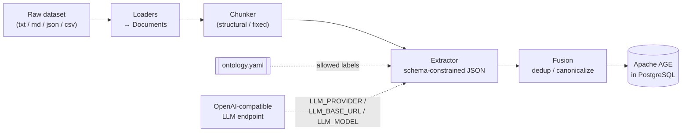

# GoldenGraphRAG

[](https://bebopcode.github.io/GoldenGraphRAG/)
[](https://www.python.org/)
[](LICENSE)

**Turn any text dataset into a queryable knowledge graph using any OpenAI-compatible
LLM and PostgreSQL + Apache AGE.**

GoldenGraphRAG (package: `kg-pipeline`, CLI: `kg`) is a modular, config-driven
pipeline: it loads documents, chunks them along their natural structure, extracts
entities and relationships with an LLM constrained to a declared ontology, fuses
duplicate entities into canonical nodes, and stores the result as a property graph in
Apache AGE — openCypher *inside* PostgreSQL.

- **Any OpenAI-compatible LLM** — OpenRouter, vLLM, OpenAI, Together, Fireworks,
  LiteLLM, Ollama. The LLM is a set of `.env` values, not a code path.
- **New domain = one YAML file** — the ontology declares the only legal labels;
  swapping domains never touches Python.
- **Idempotent writes** — `MERGE`-based upserts, so re-running ingestion updates
  the graph instead of duplicating it.

## Architecture



## Quickstart

```bash
git clone https://github.com/BebopCode/GoldenGraphRAG.git && cd GoldenGraphRAG
cp .env.example .env            # then edit POSTGRES_PASSWORD + LLM_* values

docker compose up -d            # starts PostgreSQL 16 + Apache AGE

python3 -m venv .venv && source .venv/bin/activate
pip install -e .                # installs the `kg` console command

kg info --check-llm             # pings the endpoint: bad URL/key/model fails in seconds
kg init                         # create the AGE graph (idempotent)
kg ingest data/samples/example.txt        # run the full pipeline
kg query "MATCH (n) RETURN n LIMIT 10"    # query it with openCypher
```

An LLM endpoint is the one external dependency beyond Docker — the fastest path is an
[OpenRouter](https://openrouter.ai) key; fully-local works via Ollama or vLLM.

## Documentation

Full docs live at **[bebopcode.github.io/GoldenGraphRAG](https://bebopcode.github.io/GoldenGraphRAG/)**:

- [Quickstart](https://bebopcode.github.io/GoldenGraphRAG/quickstart/) — setup in detail
- [Configuration](https://bebopcode.github.io/GoldenGraphRAG/configuration/) — every `.env` variable and `settings.yaml` knob
- [LLM Providers](https://bebopcode.github.io/GoldenGraphRAG/providers/) — OpenRouter, vLLM, Ollama, and friends
- [Ontologies](https://bebopcode.github.io/GoldenGraphRAG/ontologies/) — define a new domain in YAML
- [Architecture](https://bebopcode.github.io/GoldenGraphRAG/architecture/) — the five stages, and how to swap any of them
- [Troubleshooting](https://bebopcode.github.io/GoldenGraphRAG/troubleshooting/) — known limitations and fixes

## Contributing

PRs welcome — see [CONTRIBUTING.md](CONTRIBUTING.md). MIT licensed, see [LICENSE](LICENSE).
