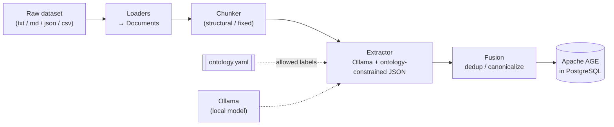

# kg-pipeline

**Turn any text dataset into a queryable knowledge graph using a local LLM and PostgreSQL + Apache AGE.**

`kg-pipeline` is a modular, config-driven pipeline: it loads documents, chunks them
along their natural structure, extracts entities and relationships with a local Ollama
model constrained to a declared ontology, fuses duplicate entities into canonical nodes,
and stores the result as a property graph in Apache AGE — which runs openCypher *inside*
PostgreSQL. The ontology is a YAML file, so swapping domains (Constitution → movies →
anything) is an edit to that file, never to Python.

---

## Architecture



The five stages map to modules behind interfaces, so each can be swapped independently:

- **Load** (`kg.ingest.loaders`) — `.txt/.md/.json/.csv` → normalized `Document`s.
- **Chunk** (`kg.ingest.chunkers`) — structure-aware (headers/sections) or fixed-size.
- **Extract** (`kg.extract`) — one ontology-constrained LLM call per chunk; off-ontology
  output is dropped and logged.
- **Fuse** (`kg.fusion`) — normalize names, merge duplicates, rewire edges.
- **Store** (`kg.store.age_store`) — idempotent `MERGE` upserts into AGE, with `agtype`
  deserialization on read.

---

## Prerequisites

- **Python 3.11+**
- **Docker** (+ Docker Compose)
- **Ollama** installed and running on the host, with a model pulled, e.g.:
  ```bash
  ollama pull llama3.1      # or: qwen3, mistral, gemma, …
  ```
  Any model that follows Ollama's JSON mode works. (A cloud-routed model like
  `glm-5:cloud` will not work without extra auth — prefer a local model.)

---

## Setup

```bash
git clone <your-repo-url> kg-pipeline && cd kg-pipeline
cp .env.example .env            # then edit POSTGRES_PASSWORD + OLLAMA_MODEL

docker compose up -d            # starts PostgreSQL 16 + Apache AGE

python3 -m venv .venv && source .venv/bin/activate
pip install -r requirements.txt
pip install -e .                # installs the `kg` console command
```

Confirm it's alive:
```bash
docker compose ps              # kg-age should be (healthy)
kg info                        # prints effective config + ontology (no DB/Ollama needed)
```

---

## Usage

```bash
kg init                                   # create the AGE graph (idempotent)
kg ingest data/samples/example.txt        # run the full pipeline
kg query "MATCH (n) RETURN n LIMIT 10"    # run an openCypher query
```

Other commands:
```bash
kg ingest data/samples/ --limit 5         # ingest a directory, first 5 chunks only
kg info                                   # show resolved config + ontology labels
```

Point the CLI at a different config with `--env <file>` (handy for different ontologies /
graphs — see below).

### Example queries

```bash
# What entities exist, and their type?
kg query "MATCH (n) RETURN n.name AS name, n.type AS type"

# Who is related to whom?
kg query "MATCH (a)-[r]->(b) RETURN a.name AS src, type(r) AS rel, b.name AS tgt"

# Count nodes by label
kg query "MATCH (n) RETURN labels(n) AS label, count(n) AS n"
```

Query results are deserialized from AGE's `agtype` to plain Python dicts/values and
printed as JSON. Multi-column `RETURN` clauses are supported.

---

## Defining your own ontology

The ontology is plain YAML — node types and relationship types with their allowed
source/target labels. The extractor injects these as the *only* legal labels and
validates the model's output against them. A new domain is a new file:

```yaml
# config/ontologies/movies.yaml
name: movies
description: A simple movie ontology.

node_types:
  - label: Movie
    properties: [title, year]
  - label: Person
    properties: [name]

relationship_types:
  - label: ACTED_IN
    source: Person
    target: Movie
  - label: DIRECTED
    source: Person
    target: Movie
```

Then point the pipeline at it (no code changes):
```bash
ONTOLOGY_PATH=config/ontologies/movies.yaml kg ingest my_movies.json
# or: edit .env, or use: kg ingest my_movies.json --env .env.movies
```

Invalid ontologies fail loud at startup — a relationship referencing an undeclared node
label, duplicate labels, or an empty node list all raise immediately. See the two shipped
examples in `config/ontologies/` (`generic.yaml`, `constitution.yaml`).

---

## Swapping components

Everything pluggable sits behind an abstract base class, so a new implementation is a new
class plus one line of construction in `pipeline.py`.

**Replace the LLM.** Implement `kg.llm.base.LLMClient` (one method: `complete(...)`).
An OpenAI/Anthropic client would call the provider's API inside `complete` and otherwise
look identical. Wire it in `pipeline.py` where `OllamaLLMClient` is constructed.

**Replace the store.** Implement `kg.store.base.GraphStore`
(`init_graph / upsert_node / upsert_edge / query`). A Neo4j store would translate those to
native Cypher (no `cypher()`-in-SQL wrapper, no `agtype`) — the openCypher query knowledge
transfers directly. Construct it in `pipeline.py` instead of `AgeGraphStore`.

**Replace the chunker.** Implement `kg.ingest.chunkers.base.Chunker` and register it in
`get_chunker()` (`kg/ingest/chunkers/__init__.py`).

---

## Project structure

```
kg-pipeline/
├── docker-compose.yml          # PostgreSQL 16 + Apache AGE
├── docker/init-age.sql         # creates extension + default graph on first start
├── config/
│   ├── settings.example.yaml   # tuning (chunk sizes, batch sizes, temperature)
│   └── ontologies/             # generic.yaml, constitution.yaml
├── data/samples/               # tiny committed samples
├── scripts/smoke_test.py       # end-to-end sanity run
├── src/kg/
│   ├── cli.py                  # `kg` Typer entrypoint
│   ├── config/                 # pydantic models + YAML/.env loader (validates at startup)
│   ├── llm/                    # LLMClient ABC + Ollama implementation
│   ├── ingest/                 # loaders + chunkers (structural / fixed)
│   ├── extract/                # ontology-constrained LLM extractor + prompts + schemas
│   ├── fusion/                 # entity resolution / dedup
│   ├── store/                  # GraphStore ABC + Apache AGE implementation
│   └── pipeline.py             # load → chunk → extract → fuse → store
└── tests/
    ├── unit/                   # config, chunkers, extractor (mocked LLM), fusion
    └── integration/            # AgeGraphStore round-trip (needs the container)
```

### Running tests

Unit tests need nothing external (the LLM and store are mocked):
```bash
pytest tests/unit
```

Integration tests need the AGE container up:
```bash
docker compose up -d
pytest tests/integration        # auto-skips if the DB isn't reachable
```

Lint and format:
```bash
ruff check src tests scripts
ruff format src tests scripts
```

---

## Limitations & next steps

This project deliberately builds the **graph-construction** pipeline only. It is honest
about what it does not do yet:

- **No retrieval / QA layer.** It builds the graph; querying it intelligently
  (GraphRAG-style retrieval + answering) is a future phase.
- **No text-to-Cypher.** Queries are hand-written openCypher.
- **No web UI** — CLI only.
- **Local Ollama only** — no cloud/API LLM (though the `LLMClient` interface makes adding
  one trivial). Ollama runs on the host, not in the compose file.
- **Fusion is string-based.** Normalized matching collapses "Article 21"/"Art. 21", but
  semantic aliases ("the right to life" → "Article 21") need embeddings — there's a
  `use_embeddings` hook left for that.
- **Extraction quality** depends on the model and prompt. Larger/better models and
  per-domain prompt tuning will improve precision; the ontology constraint already does
  most of the heavy lifting.
- **Throughput** is per-chunk single-threaded with one `MERGE` per node/edge. For large
  datasets, batch `UNWIND` upserts and parallel extraction are natural follow-ups.
