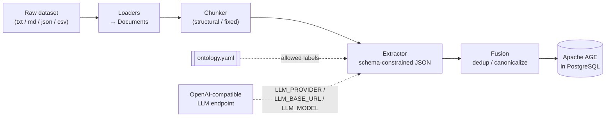

# Architecture

## The five stages

Each stage sits behind an interface (`src/kg/`), so any of them can be swapped
independently — the pipeline composes concrete classes; the flow never changes.

### 1. Load — `kg.ingest.loaders`

`.txt` / `.md` / `.json` / `.csv` files become normalized `Document` objects
(id + text + provenance metadata). Adding a format is a new function plus one line
in the loader registry.

### 2. Chunk — `kg.ingest.chunkers`

Documents are split along their natural structure — markdown headers first, then a
heuristic section detector (ALL-CAPS titles, `Article N`, numbered headings). The
active heading *path* rides along in each chunk's metadata so the extractor still
knows where a chunk came from. A fixed-size chunker with word-boundary windows and
overlap is the fallback for unstructured text.

### 3. Extract — `kg.extract`

One LLM call per chunk, with the ontology injected as the *only* legal labels and the
JSON Schema sent alongside so endpoints with structured outputs can constrain decoding.
Malformed JSON gets one stricter retry, then the chunk is skipped and logged —
extraction is probabilistic, and one poisoned chunk must not kill a long ingest.
Off-ontology output is dropped and logged. Extraction fans out across threads
(`LLM_CONCURRENCY`); failures are isolated per chunk.

### 4. Fuse — `kg.fusion`

The same real-world entity surfaces under different names across chunks ("Article 21"
vs "Art. 21"). The resolver normalizes names, groups by the normalized key, picks a
canonical representative (most frequent surface form, ties to the longest), merges
properties, and rewires every relationship to canonical names. Identical edges are
merged; self-loops created by fusion are dropped.

### 5. Store — `kg.store.age_store`

Idempotent `MERGE`-based upserts into Apache AGE (openCypher inside PostgreSQL).
Nodes first — edges `MATCH` their endpoints by name. Reads deserialize AGE's
`agtype` to plain Python values. Writes stay single-threaded by design: the
MERGE-based upserts are not safe to interleave.

## Extending: swap any stage

Everything pluggable sits behind an abstract base class, so a new implementation is a
new class plus one line of construction in `pipeline.py`.

**Replace the LLM.** Any OpenAI-compatible endpoint already works with zero code —
it's `.env` values. For a provider that *isn't* OpenAI-compatible, implement
`kg.llm.base.LLMClient` (one method: `complete(...)`, plus optional
`health_check`/`close`) and register a preset in `kg/llm/factory.py`.

**Replace the store.** Implement `kg.store.base.GraphStore`
(`init_graph / upsert_node / upsert_edge / query`). A Neo4j store would translate
those to native Cypher (no `cypher()`-in-SQL wrapper, no `agtype`) — the openCypher
query knowledge transfers directly. Construct it in `pipeline.py` instead of
`AgeGraphStore`.

**Replace the chunker.** Implement `kg.ingest.chunkers.base.Chunker` and register it
in `get_chunker()` (`kg/ingest/chunkers/__init__.py`).
